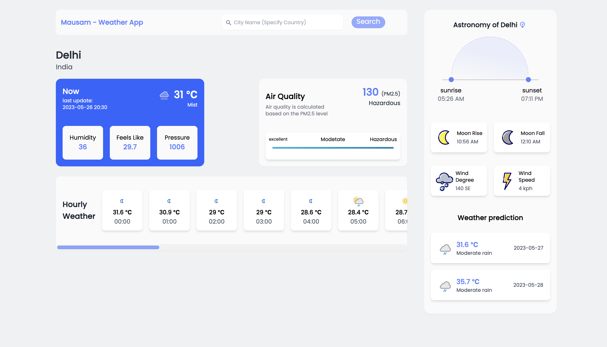

<br/>
[Mausam-Weather App](https://mausam-weather-app18.vercel.app/), This app is developed using React.js and Tailwind CSS. User can search locations by city name and observe the weather.

# Mausam - Weather App:

Link: https://mausam-weather-app18.vercel.app/

# APIs
+ Weather data is retrieved from https://www.weatherapi.com/

# Weather Forecast Application with WeatherAPI

The Weather Forecast Application is a project that utilizes the WeatherAPI to provide users with detailed and up-to-date weather information. The application offers both daily and hourly temperature and humidity forecasts for a specified location. Users can input their desired location, and the application will retrieve the weather data from the WeatherAPI and display it in an easy-to-understand format.


## Key Features

1. **Current Weather Data:** The application retrieves the current temperature, humidity, air quality, and astronomical data (such as sunrise and sunset times) for the specified location and displays it on the main screen.

2. **Daily Forecast:** Users can view the daily temperature, humidity, air quality, and astronomical data for the next few days. The application fetches the daily weather data from the WeatherAPI and presents it in a user-friendly manner, including highs and lows for each day.

3. **Hourly Forecast:** Users can access the hourly temperature, humidity, air quality, and astronomical data for the current day. The application retrieves the hourly weather data from the WeatherAPI and presents it in a tabular format, allowing users to see the changes throughout the day.

4. **Location Search:** The application provides a search functionality that enables users to input their desired location. It then fetches the weather data specific to that location from the WeatherAPI.

5. **Visual Representation:** The application uses intuitive graphical elements, such as icons and color-coded visuals, to represent weather conditions, air quality levels, and astronomical data. This makes it easier for users to understand the forecast and related information at a glance.

6. **Error Handling:** The application includes robust error handling to handle scenarios such as network connectivity issues or invalid location inputs. It provides appropriate error messages and guidance to the user.

7. **User-Friendly Interface:** The application is designed with a clean and intuitive user interface, ensuring a smooth and enjoyable user experience. It is responsive and compatible with various devices, including desktop and mobile platforms.


## Technologies Used

- WeatherAPI: The project integrates the WeatherAPI to fetch weather data, including temperature and humidity, for the specified location.
- Front-End Development: ReactJs and TailwindCSS
- API Integration: Axios

By combining the power of the WeatherAPI and an intuitive user interface, the Weather Forecast Application provides users with accurate and detailed daily and hourly temperature and humidity forecasts. It empowers users to plan their activities effectively based on the weather conditions, whether it's deciding on appropriate clothing, scheduling outdoor events, or making travel arrangements.


# Getting Started with Create React App

This project was bootstrapped with [Create React App](https://github.com/facebook/create-react-app).

# Install

In the terminal run these commands:

```
git clone https://github.com/theanuraaag/Mausam-Weather-App.git
npm install
npm start
```
## Todos

- [ ] To add changing background according to different weather.
- [ ] To implement auto-suggest cities in search bar.
- [ ] On launch, find user location weather by utilizing GeolocationAPI/GEOCODING
- [ ] Dark/Light Mode


## Learn More

You can learn more in the [Create React App documentation](https://facebook.github.io/create-react-app/docs/getting-started).

To learn React, check out the [React documentation](https://reactjs.org/).


